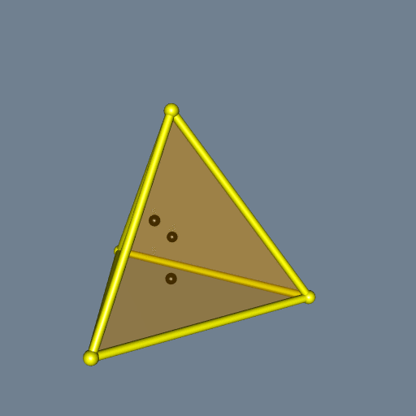
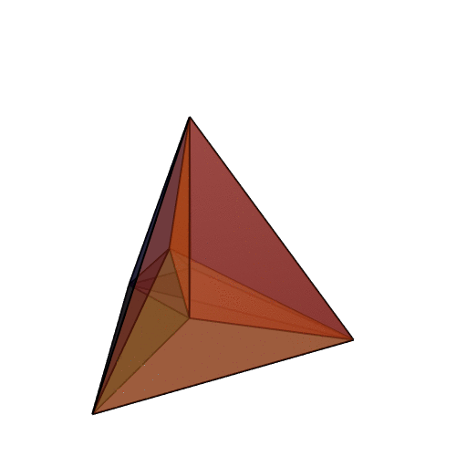
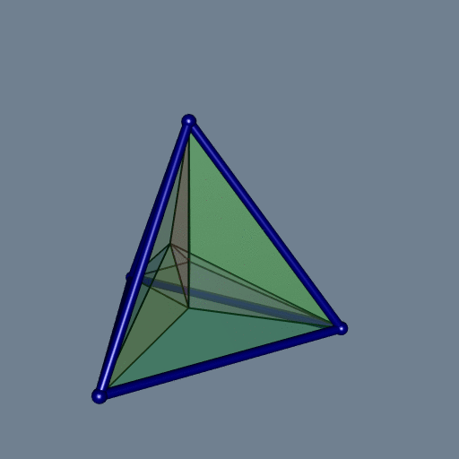
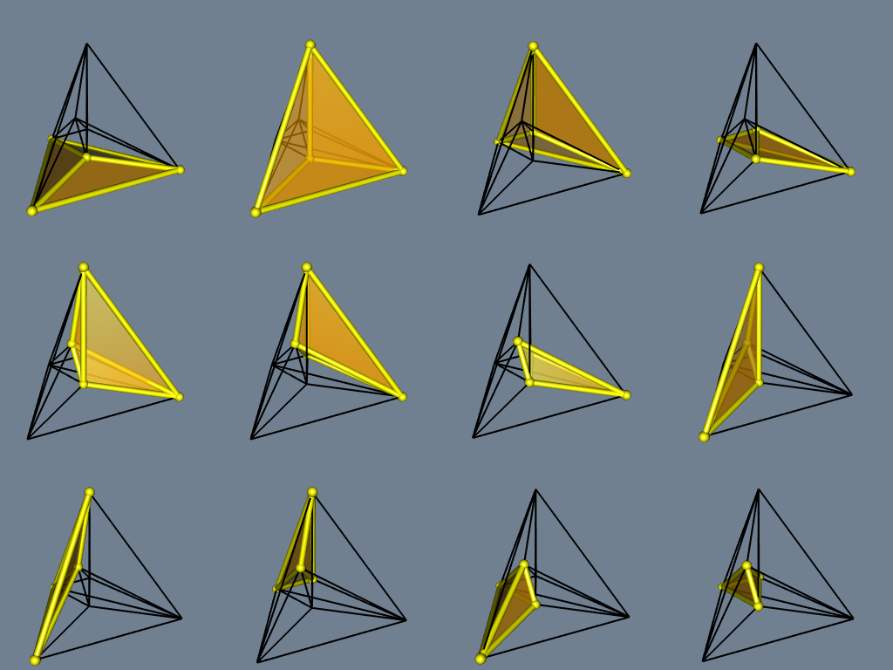
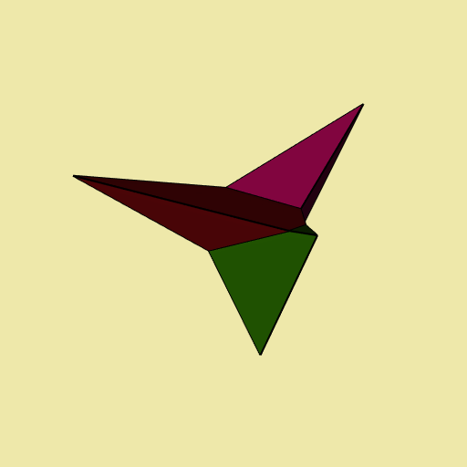
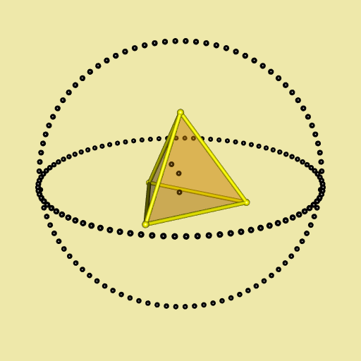
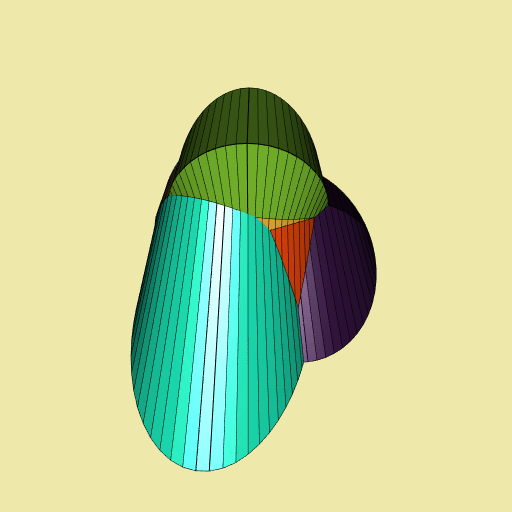
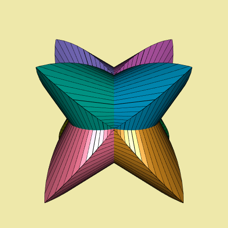
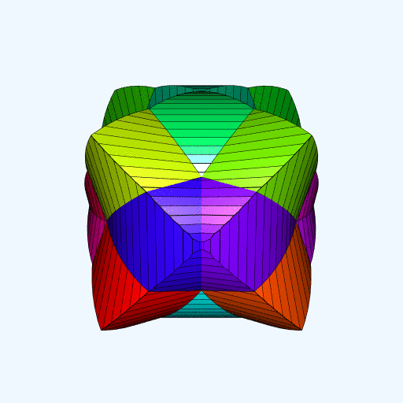

```{r, include = FALSE}
knitr::opts_chunk$set(
  collapse = TRUE,
  comment = "#>"
)
options(rgl.useNULL=TRUE)
```

```{r setup}
library(tessellation)
```

# Delaunay tessellation

The main function of the **tessellation** package is `delaunay`. It performs 
the Delaunay tessellation (or triangulation) of a set of points.

Let's try it on a simple figure. We take a regular tetrahedron and we add three 
points at random in its interior:

```{r tetrahedron}
tetrahedron <-
  rbind(
    c(2*sqrt(2)/3, 0, -1/3),
    c(-sqrt(2)/3, sqrt(2/3), -1/3),
    c(-sqrt(2)/3, -sqrt(2/3), -1/3),
    c(0, 0, 1)
  )
library(uniformly)
set.seed(314)
randomPoints <- runif_in_tetrahedron(
  3, tetrahedron[1, ], tetrahedron[2, ], tetrahedron[3, ], tetrahedron[4, ]
)
```

Let's do a function to plot a tetrahedron. We will use it several times.

```{r plotTetrahedronFunction}
library(rgl)
plotTetrahedron <- function(tetrahedron, alpha){
  faces <- combn(4L, 3L)
  for(j in 1L:ncol(faces)){
    triangles3d(tetrahedron[faces[, j], ], color = "orange", alpha = alpha)
  }
  edges <- combn(4L, 2L)
  for(j in 1L:ncol(edges)){
    shade3d(
      cylinder3d(tetrahedron[edges[, j], ], sides = 60, radius = 0.03),
      color = "yellow"
    )
  }
  spheres3d(tetrahedron, radius = 0.05, color = "yellow")
}
```

Here is our tetrahedron with its three additional random points:

```{r tetrahedron_rgl, eval=FALSE}
open3d(windowRect = c(50, 50, 562, 562))
bg3d("slategray")
plotTetrahedron(tetrahedron, alpha = 0.3)
spheres3d(randomPoints, radius = 0.04, color = "black")
```



Now let's compute and plot the Delaunay tessellation of these seven points:

```{r tetrahedron_delaunay, eval=TRUE, results='hide'}
library(tessellation)
pts <- rbind(tetrahedron, randomPoints)
del <- delaunay(pts)
open3d(windowRect = c(50, 50, 562, 562))
material3d(lwd = 2)
plotDelaunay3D(del, color="random", luminosity = "bright", alpha=0.5)
```



It is not easy to visualize a 3D Delaunay tessellation. The colors are not 
very helpful. Something which helps a little is to plot the exterior edges as 
tubes. To do so, one firstly has to execute the `delaunay` function with the 
option `exteriorEdges=TRUE`, then one has to run the `plotDelaunay3D` function 
with the option `exteriorEdgesAsTubes=TRUE`:

```{r tetrahedron_delaunay_with_tubes, eval=FALSE}
del <- delaunay(pts, exteriorEdges = TRUE)
open3d(windowRect = c(50, 50, 562, 562))
bg3d("slategray")
material3d(lwd = 2)
plotDelaunay3D(
  del, color="random", luminosity = "bright", alpha = 0.2,
  exteriorEdgesAsTubes = TRUE, tubeRadius = 0.03, tubeColor = "navy"
)
```



Let's have a look at each tile, separately:




# Voronoï tessellation

The Delaunay tessellation is mainly implemented in C, with the **Qhull** 
library. The Voronoï tessellation, that we will see now, is derived from the 
Delaunay tessellation and this derivation is implemented in R only.

The Voronoï tessellation is obtained with the `voronoi` function. It is 
restricted to its bounded cells. Let's see what it gives on our example:

```{r voronoi, eval=TRUE, message=FALSE}
v <- voronoi(del)
open3d(windowRect = c(50, 50, 562, 562))
bg3d("palegoldenrod")
material3d(lwd = 2)
plotVoronoiDiagram(v, luminosity = "dark")
```



Well, not very funny. Let's add some fun. We draw two circles around the 
tetrahedron (two sets of points on circles, I should say):

```{r tetrahedron_with_circls, eval=TRUE, results='hide'}
xi_ <- seq(0, 2*pi, length.out = 91)[-1]
R <- 2
circle1 <- t(vapply(xi_, function(xi) R * c(cos(xi), sin(xi), 0), numeric(3L)))
circle2 <- t(vapply(xi_, function(xi) R * c(cos(xi), 0, sin(xi)), numeric(3L)))
circles <- rbind(circle1, circle2)
open3d(windowRect = c(50, 50, 562, 562), zoom=0.7)
bg3d("palegoldenrod")
plotTetrahedron(tetrahedron, alpha = 0.3)
spheres3d(randomPoints, radius = 0.04, color = "black")
spheres3d(circles, radius = 0.04, color = "black")
```



And now we gonna draw the Voronoï diagram of this object. There are seven 
bounded cells:

```{r nboundedcells}
object <- rbind(tetrahedron, randomPoints, circles)
del <- delaunay(object)
v <- voronoi(del)
```

In fact these are the cells corresponding to the four tetrahedra vertices and 
the three random points.

```{r voronoi_tetrahedron_with_circles, eval=FALSE}
library(viridisLite)
open3d(windowRect = c(50, 50, 562, 562))
bg3d("palegoldenrod")
plotVoronoiDiagram(v, colors = turbo(7))
```



Now, let's enclose a cube with three circles, and let's draw the corresponding 
Voronoï diagram:

```{r cubewithcircles}
cube <-
  rbind(
    c(-1, -1, -1),
    c( 1, -1, -1),
    c(-1,  1, -1),
    c( 1,  1, -1),
    c(-1, -1,  1),
    c( 1, -1,  1),
    c(-1,  1,  1),
    c( 1,  1,  1)
  )
xi_ <- seq(0, 2*pi, length.out = 91)[-1]
R <- 3
circle1 <- t(vapply(xi_, function(xi) R*c(cos(xi), sin(xi), 0), numeric(3L)))
circle2 <- t(vapply(xi_, function(xi) R*c(cos(xi), 0, sin(xi)), numeric(3L)))
circle3 <- t(vapply(xi_, function(xi) R*c(0, cos(xi), sin(xi)), numeric(3L)))
enclosedCube <- rbind(cube, circle1, circle2, circle3)
d <- delaunay(enclosedCube, degenerate = TRUE)
v <- voronoi(d)
library(paletteer) # provides many color palettes
open3d(windowRect = c(50, 50, 512, 512))
bg3d("palegoldenrod")
plotVoronoiDiagram(v, colors = paletteer_c("grDevices::Dark 3", 8L))
```



The Voronoï diagram is highly symmetric.


# Option `degenerate = TRUE`

I encountered some cases for which I had to set the option `degenerate=TRUE` in 
the `delaunay` function in order to get a better Voronoï diagram. This is the 
case for example of this dodecahedron surrounded by three circles:

```{r dodecahedron_with_circles, eval=FALSE}
xi_ <- seq(0, 2*pi, length.out = 91)[-1]
R <- 3
circle1 <- t(vapply(xi_, function(xi) R * c(cos(xi), sin(xi), 0), numeric(3L)))
circle2 <- t(vapply(xi_, function(xi) R * c(cos(xi), 0, sin(xi)), numeric(3L)))
circle3 <- t(vapply(xi_, function(xi) R * c(0, cos(xi), sin(xi)), numeric(3L)))
circles <- rbind(circle1, circle2, circle3)
dodecahedron <- t(dodecahedron3d()$vb[-4,])
pts <- rbind(dodecahedron, circles)
del <- delaunay(pts, degenerate = TRUE)
v <- voronoi(del)
open3d(windowRect = c(50, 50, 562, 562))
bg3d("aliceblue")
plotVoronoiDiagram(v, colors = rainbow(20))
```




Try it with `del <- delaunay(pts, degenerate = FALSE)`. 
